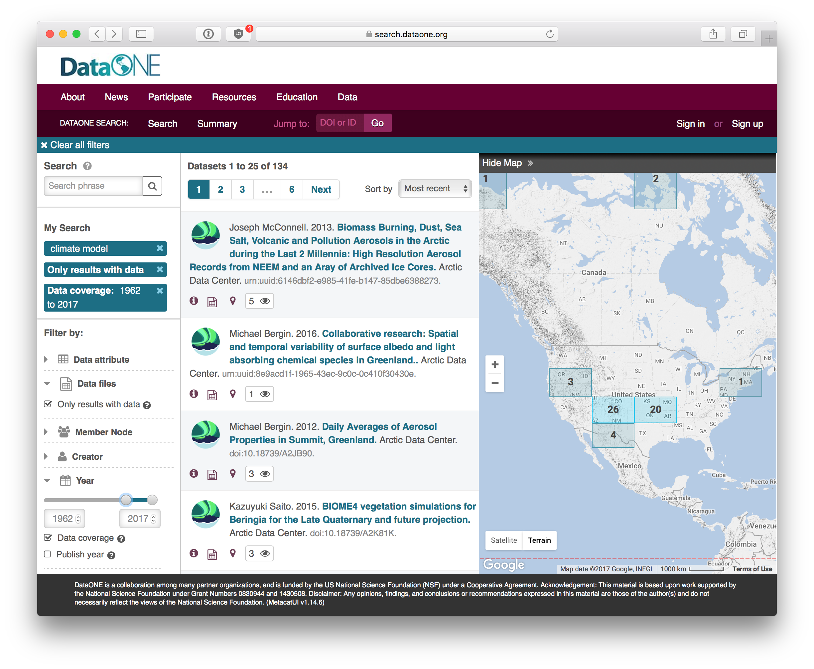
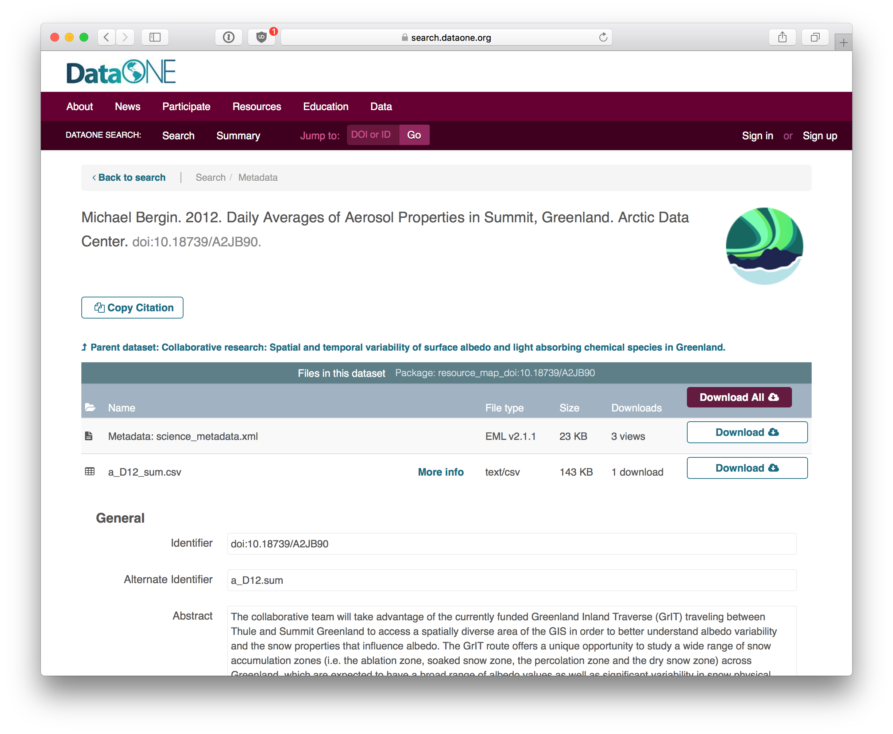
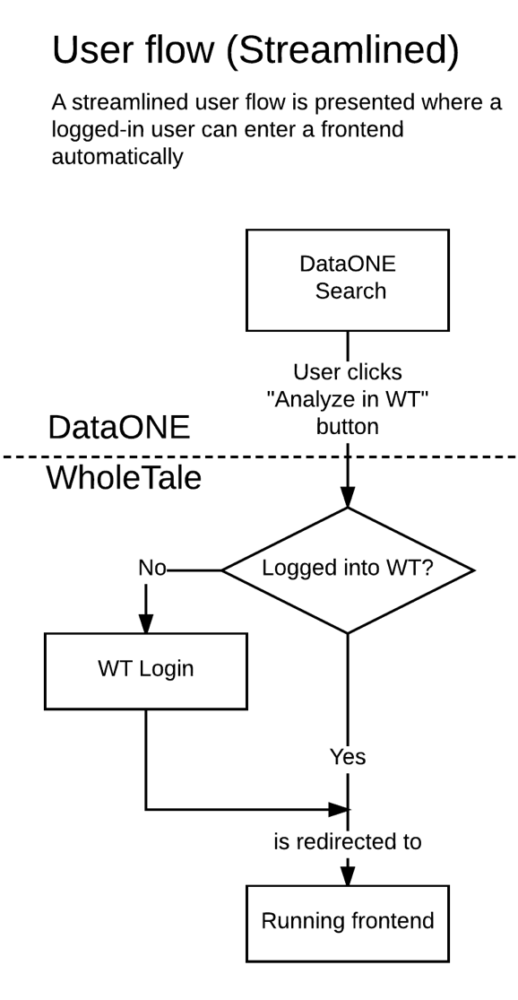

# WholeTale & DataONE Integration

## Executive Summary

- We need to provide an easy way from within [search.dataone.org](https://search.dataone.org) to regsiter datasets into WholeTale that is more advanced than the current system
- This can be done by placing "Add to WholeTale" buttons on DataONE dataset landing pages and/or by providing a "Shopping Cart"-like interface for users to create a collection of datasets to add to WholeTale
- Until DataONE and WholeTale auth are integrated, the easiest way to do this is by redirecting the user from [search.dataone.org](https://search.dataone.org) to WholeTale with the dataset(s) to be registered set up as query parameters
- This, while easy for me, will require changes in the **Dashboard** to recognize the redirect request

## Background

WholeTale is all about analyzing data so making data available to a running WholeTale front-end should be easy for the user.
There are currently two approaches to get data into WholeTale:

1. From within a running front-end (e.g. RStudio Server), by retrieving data over the Internet with code running in the front-end
2. Register a dataset before launching the front-end (better)

While approach (1) works and fits well within the reproducibility goals of WholeTale, (2) is arguably more formal and, unlike (1), can make use of the WholeTale backend infrastructure to make the registered dataset available to the running front-end which is more efficient.

Data registration currently happens during the set-up phase along with selecting a front-end image and can register data from a limited set of providers.

To register data from DataONE into WholeTale, we have implemented a simplified DataONE registration interface that requires the user to specify a DataONE identiifer which is just about the most difficult way we can come up with for a user to register DataONE data with WholeTale.
Because DataONE already has a feature-rich [search tool](https://search.dataone.org) (DataONE Search), it makes a lot of sense to also allow registration of data from within DataONE Search.

There are two views where it makes sense to add WholeTale & DataONE integration:

1. The **Catalog**
2. Each dataset's **Landing Page**

While searching the **Catalog**, a list of datasets matching the user's set of filters is shown:



and when a user clicks on one of those datasets, a **Landing Page** is shown:



## Proposal

I propose DataONE search provides a way for users to register DataONE data into WholeTale in both the **Catalog** and **Landing Page** views.

To get data into WholeTale, WholeTale only needs to know the identifier because WholeTale already supports the DataONE API. 
A simple button "Add to WholeTale" on each **Landing Page** would be sufficient.
However, if a user wants to mix and match a number of datasets which may be contained across numerous, different searches or search pages, they need a way to flag individual datasets for inclusion in their created Tale.
Therefore, some sort of "Shopping Cart"-like interface seems reasonable where a user can prepare a list of datasets they want to add to their Tale and, after a number of datasets have been added to this list, they can add part of or the entire list to a new Tale.

I propose we integrate DataONE and WholeTale in a two-phase manner.

- **First phase:** Just add simple buttons to both views for adding single datasets
- **Second phase:** Implement a shopping cart of sorts for adding multiple datasets

## Mock-ups

### Catalog View Integration (Shopping cart metaphor)


### Landing Page Integration

With the buttons, I want to get the look and feel right, especially:

- Verbage "Run", "Analyze", etc
- Give enough explanation to the user as to what it is they're about to do

I've mocked up some button ideas and placed some of them on a landing page to give everyone a feel for how these could look.

#### Buttons


#### Button placement ideas


### Implementation details

How this is implemented makes a huge difference in terms of the difficulty of implementation.
The current API already already has a method for registering a dataset, `POST /dataset/register`, which requires a payload like:

```json
{
    "dataId": "urn:uuid:42969280-e11c-41a9-92dc-33964bf785c8",
    "doi": "10.5063/F1Z899CZ",
    "name": "Data from a dynamically downscaled projection of past and future microclimates covering North America from 1980-1999 and 2080-2099",
    "repository": "DataONE",
    "size": 178679
}
```

A button could, for example, trigger an async request to this endpoint with an appropriate payload and the specified dataset would then be registered in WholeTale.
I think this is (or should be) an authenticated route and, at present, DataONE authentication knows nothing about WholeTale authentication (*Note: this may change*).
Therefore, this existing route would is not workable for now.

A way around this is to simply redirect the user over to WholeTale to a view on the **Dashboard** uses prepopulated query parameters to tell WholeTale which dataset(s) to register, e.g.,

`https://search.dataone.org/#view/doi:10.18739/A2JB90 -> https://dashboard.wholetale.org/register/dataone/doi%3A10.18739%2FA2JB90`

**Upsides:**

- No need (*for now*) to integrate DataONE and WholeTale authentication
- User automatically appears in WholeTale, ready to work

**Downsides:**

- Various clients have limitations on the length or URLs so the user would only be able to register a finite number of datasets at a time

### User flow

How the user navigates through this process matters particularly because the user may not be familiar with WholeTale and a difficult or confusing user experience could turn the user away. The simplest possible user flow would be to bolt the DataONE side of the interaction directly onto the WholeTale Dashboard as it exists now.


As can be seen in the above image, the user spends a lot of time configuring the WholeTale dashboard just to get started working in their front-end.
A second, simplified user flow is possible where the choice of front-end and data are automatically pre-filled by the redirect from DataONE:


